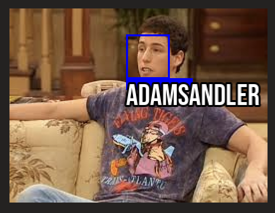
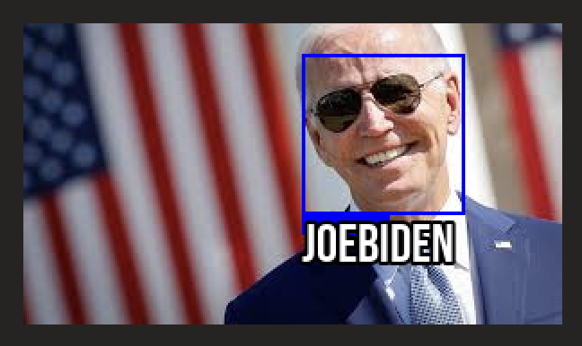
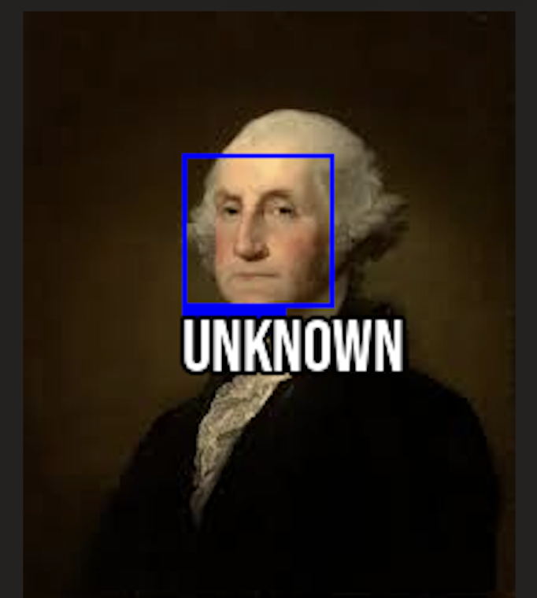

# Facial Recognition Program


A Python-based facial recognition program that can encode, validate, and recognize faces using the face_recognition and Pillow libraries. Supports both hog and cnn models and provides a clean command-line interface for training and testing the model.

## How To Use
### Encoding Faces
- Within the `/training` directory create a subdirectory with the name of the person who you want to train the model on.
- Insert as many pictures as you see necessary into this subdirectory.
    - Example format can be found in the /training directory.
- Run the command `python detector.py --train` to train the model on these faces and save the encodings to /output.

### Validating The Model
- Within the `/validation` directory place images of faces that you are positive of the identity.
- This feature helps you ensure that the model is working correctly and will identify faces with correct accuracy.
- Run the command `python detector.py --validate` to validate the model and check that it detects faces correctly.

### Testing The Model (Actually recognizing faces!)
- Now that you have encoded the faces and validated the model you can actually recognize faces.
- This feature allows you to select any image containing a face and will compare the faces present in that image against the facial encodings that the model has learned so far.
- **NOTE:** 
    - `-f path/to/image.jpg` is required for this command to work! 
    - `-m model` is optional! Hog is a CPU based model and CNN is a GPU based model. *Hog is set as the default model*.
- Run the command `python detector.py --test -f path/to/image.jpg` to detect faces in images.

## Basic Terminal Commands
- Run `python detector.py --h` OR `python detector.py --help` to view all commands.
- For ease of use in this repository I have listed the commands below as well.
    - *-h, --help*    show this help message and exit
    - *--train*      Train on input data.
    - *--validate*    Validate trained model.
    - *--test*        Test the model with an unknown image.
    - *-m {hog,cnn}*  Which model to use for training: hog (CPU) or cnn (GPU).
    - *-f F*          Path to an image with an unknown face.

## Requirements
- [Python3](https://www.python.org/downloads/)
- [face_recognition](https://github.com/ageitgey/face_recognition)
- [Pillow](https://pypi.org/project/pillow/)

## Setup and Running
- Ensure Python3 is downloaded on your system.
- Download this repository.
- Create a Python virtual environment.
    - Within the project directory execute the following command, ```python -m venv myenv```.
        - **NOTES:**
            - myenv can be whatever name you would like.
            - Some systems may require you to run python with the name of python3 instead.
- Activate your virtual environment.
    - Within the project directory execute the following command, ```source myenv/bin/activate```.
- Install the requirements.
    - Within the project directory and with the virtual environment active execute, ```pip install -r requirements.txt```.
- Now you should be able to run ```python detector.py```.
    - **NOTE:** Since you are in the virtual environment you should be able to use either python or python3 without any issue!

## Repository Structure

```
project/
│
├── training/         # Subfolders named after people for model training
├── validation/       # Known test images for validation
├── output/           # Saved encodings and model files
├── assets/           # Fonts that the program uses, README images
├── detector.py       # Main facial recognition script
├── requirements.txt  # Python dependencies
└── README.md         # This file
```

## Example Outputs

<p></p>

<p></p>


**NOTE:** Washington is unknown since our model was not trained on his images!

## Credits
- Libraries
    - [face_recognition](https://github.com/ageitgey/face_recognition)
    - [Pillow](https://github.com/python-pillow/Pillow)
- Walkthrough
    - [RealPython](https://realpython.com/face-recognition-with-python/) 
    - **NOTE:** This walkthrough was used as a guide for help, not followed blindly. This project's goal was to expand my knowledge on machine learning in Python and get my hands dirty working with libraries I was not familiar with.

## License
This project is licensed under the [MIT License](./LICENSE) © 2025 Maxwell Raymond.