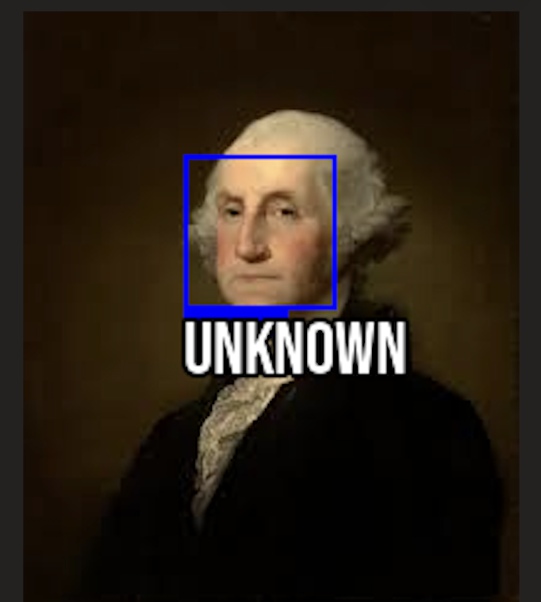

# Facial Recognition Program


A Python-based facial recognition program that can encode, validate, and recognize faces using the face_recognition and Pillow libraries. It supports both HOG and CNN models and provides a clean command-line interface for training and testing the model.

## How To Use
### Encoding Faces
- Within the `/training` directory, create a subdirectory with the name of the person you want to train the model on.
- Insert as many pictures as you see necessary into this subdirectory.
    - An example format can be found in the `/training` directory.
- Run the command `python detector.py --train` to train the model on these faces and save the encodings to `/output`.

### Validating The Model
- Within the `/validation` directory, place images of faces whose identities you are confident about.
- This feature helps ensure that the model is functioning correctly and identifying faces with proper accuracy.
- Run the command `python detector.py --validate` to validate the model and confirm that it detects faces correctly.

### Testing The Model (Recognizing Faces)
- Once you’ve encoded and validated your faces, you can use the model to recognize faces in new images.
- This feature compares faces present in an image against the trained encodings.
- **NOTE:**  
    - `-f path/to/image.jpg` is required for this command to work.  
    - `-m {hog,cnn}` is optional. HOG is CPU-based (default), while CNN uses GPU acceleration.  
- Run the command `python detector.py --test -f path/to/image.jpg` to detect faces in images.

## Basic Terminal Commands
- Run `python detector.py --h` or `python detector.py --help` to view all commands.
- For ease of use, the available commands are listed below:
    - *-h, --help*    Show this help message and exit  
    - *--train*       Train on input data  
    - *--validate*    Validate trained model  
    - *--test*        Test the model with an unknown image  
    - *-m {hog,cnn}*  Choose model type: HOG (CPU) or CNN (GPU)  
    - *-f F*          Path to an image with an unknown face  

## Requirements
- [Python 3](https://www.python.org/downloads/)
- [face_recognition](https://github.com/ageitgey/face_recognition)
- [Pillow](https://pypi.org/project/pillow/)

## Setup and Running
- Ensure Python 3 is installed on your system.
- Download this repository.
- Create a Python virtual environment:
    - In the project directory, run:  
      ```bash
      python -m venv myenv
      ```
        - **NOTES:**
            - `myenv` can be any name you like.
            - Some systems may require `python3` instead of `python`.
- Activate your virtual environment:
    ```bash
    source myenv/bin/activate
    ```
- Install dependencies:
    ```bash
    pip install -r requirements.txt
    ```
- You can now run:
    ```bash
    python detector.py
    ```
    - **NOTE:** Within a virtual environment, both `python` and `python3` should work.

## Repository Structure

## Example Outputs

<p></p>

<p></p>


**NOTE:** Washington is labeled *Unknown* since the model was not trained on his images.

## Credits
- **Libraries**
    - [face_recognition](https://github.com/ageitgey/face_recognition)
    - [Pillow](https://github.com/python-pillow/Pillow)
- **Walkthrough**
    - [RealPython](https://realpython.com/face-recognition-with-python/)  
    - **NOTE:** This walkthrough was used as a learning guide, not followed blindly. The project’s goal was to expand my understanding of machine learning in Python and gain hands-on experience with new libraries.

## License
This project is licensed under the [MIT License](./LICENSE) © 2025 Maxwell Raymond.
